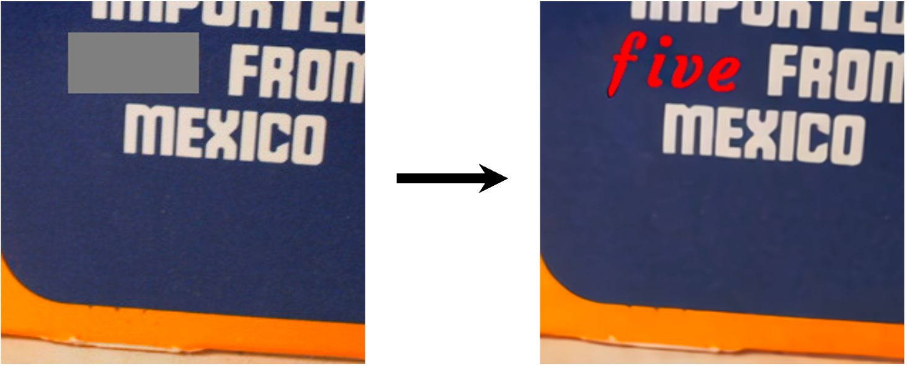
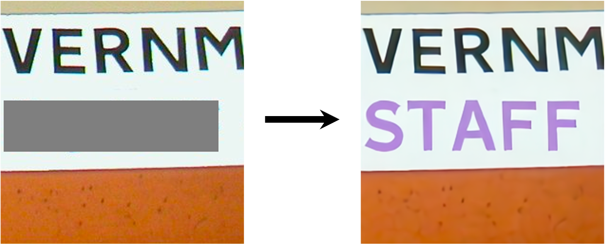
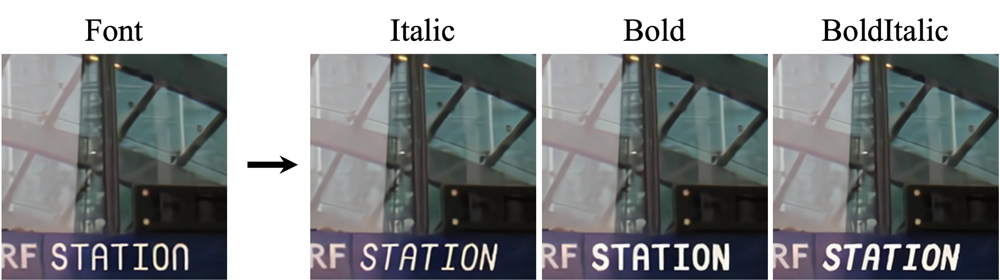

# Improving Diffusion Models for Scene Text Editing with Dual Encoders
[Jiabao Ji](https://question406.github.io)<sup>1</sup>,
[Guanhua Zhang](https://ghzhang233.github.io)<sup>1</sup>,
[Zhaowen Wang](http://www.ifp.illinois.edu/~wang308/)<sup>2</sup>,
[Bairu Hou](https://hbr690188270.github.io)<sup>1</sup>,
[Zhifei Zhang](https://zzutk.github.io)<sup>2</sup>,
[Brian Price](https://www.brianpricephd.com)<sup>2</sup>,
[Shiyu Chang](https://code-terminator.github.io/)<sup>1</sup>
<br>
<sup>1</sup>UC, Santa Barbara, <sup>2</sup>Adobe Research


This is the official implementation of the paper "Improving Diffusion Models for Scene Text Editing with Dual Encoders" \[[Arxiv](https://arxiv.org/abs/2304.05568)\].

## Overview
In this work, we propose a novel Diffusion-based Scene Text Editing (DiffSTE) framework, which is able to edit scene text into different font styles and colors following given text instruction. Specifically, we propose to improve pre-trained diffusion models with a dual encoder design, which includes a character encoder for better text legibility and an instruction encoder for better style control. We then utilize an instruction tuning framework to train our model learn the mapping from the text instruction to the corresponding image with either the specified style or the style of the surrounding texts in the background. 
Such a training method further brings our model the zero-shot generalization ability to the following three scenarios:
generating text with unseen font variation, e.g. italic and bold,
mixing different fonts to construct a new font, 
and using more relaxed forms of natural language as the instructions to guide the generation task.

## Requirements
Build the environment with the following command:
```bash
conda create -n diffste python=3.8
pip install -r requirements.txt
```
Our pretrained model can be downloaded from [here](https://drive.google.com/file/d/1fc0RKGWo6MPSJIZNIA_UweTOPai64S9f/view?usp=share_link).

## Generation samples

### Scene text editing
Run following command to edit scene text. The mask file indicates the region where the generated text locates.
```bash
python generate.py --ckpt_path ${model_path} --in_image examples/sample0.png --in_mask examples/mask0.png --text wizards --output_dir ${output_dir}
```
You should be able to get a similar result:


### Specify text style
Specify the font and color of the generated text by adding `--font` and `--color` arguments.
```bash
python generate.py --ckpt_path ${model_path} --in_image examples/sample1.png --in_mask examples/mask1.png --text five --font Courgette --color red --output_dir ${output_dir}
```
You should be able to get a similar result:



Specify the text style with a natural language instruction.
```bash
python generate.py --ckpt_path ${model_path} --in_image examples/sample2.png --in_mask examples/mask2.png --text STAFF --instruction "The word \"STAFF\" is colored in a delicate, ladylike shade of lilac"" --output_dir ${output_dir}
```
You should be able to get a similar result:



### Font variation
Generate text with unseen font variation, e.g. italic and bold. Notice that NovaMono font has no italic and bold version from google-fonts library.
```bash
python generate.py --ckpt_path ${model_path} --in_image examples/sample3.png --in_mask examples/mask3.png --text STATION --font NovaMono --output_dir ${output_dir}
python generate.py --ckpt_path ${model_path} --in_image examples/sample3.png --in_mask examples/mask3.png --text STATION --font NovaMono-Italic --output_dir ${output_dir}
python generate.py --ckpt_path ${model_path} --in_image examples/sample3.png --in_mask examples/mask3.png --text STATION --font NovaMono-Bold --output_dir ${output_dir}
python generate.py --ckpt_path ${model_path} --in_image examples/sample3.png --in_mask examples/mask3.png --text STATION --font NovaMono-BoldItalic --output_dir ${output_dir}
```
You should be able to get similar results:



Mix two different font styles.
```bash
python generate.py --ckpt_path ${model_path} --in_image examples/sample4.png --text Reload --font Allura --output_dir ${output_dir}
python generate.py --ckpt_path ${model_path} --in_image examples/sample4.png --text Reload --font Mohave --output_dir ${output_dir}
python generate.py --ckpt_path ${model_path} --in_image examples/sample4.png --text Reload --font "Allura and Mohave" --output_dir ${output_dir}
```

You should be able to get similar results:


## Train the model
You can train the model on a combination of real world scene text data and synthetic scene text data.
### Prepare Data 
1. Download real world dataset: 
```bash
sh scripts/down_data.sh
```
2. Generate synthetic dataset: 
```bash
pip install -r synthgenerator/requirements.txt
sh scripts/gen_synth.sh
```
Notice that you may need to first download fonts from google fonts library, we include a list of font names for our released model in `synthgenerator/resources/100fonts` and background images from [SynthText Project](https://github.com/ankush-me/SynthText).

The donwloaded real world data and synthetic data will be in folder `data/ocr-dataset`.

### Train script
The main training script is `train.py`. You can train the model by running
```bash
python train.py --base ${config_paths} --stage fit --name ${run_name} --project ${project_name} --base_logdir ${log_directory}
```
Logs and model will be saved in `${log_directory}/${project_name}/${time}_${run_name}`.
An example config file is in `configs` folder, which defines the hyper parameter and other information required for training.

## Reference
Our code use `pytorch-lightning` as the main framework and `diffusers` for loading pretrained stable-diffusion model. We mainly follow the implementation of [stable-diffusion](https://github.com/runwayml/stable-diffusion).

## Citation
If you find our work useful in your research, please consider citing our paper:
```bibtex
@misc{ji2023improving,
      title={Improving Diffusion Models for Scene Text Editing with Dual Encoders}, 
      author={Jiabao Ji and Guanhua Zhang and Zhaowen Wang and Bairu Hou and Zhifei Zhang and Brian Price and Shiyu Chang},
      year={2023},
      eprint={2304.05568},
      archivePrefix={arXiv},
      primaryClass={cs.CV}
}
```